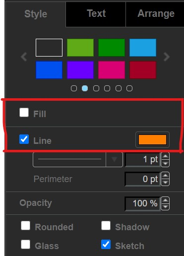
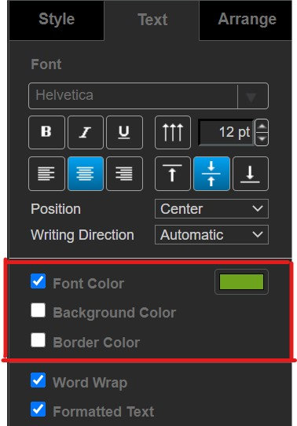
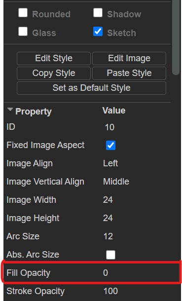

# DrawIO Styling

<!-- mdformat-toc start --slug=github --maxlevel=6 --minlevel=2 -->

- [Diagraming tools](#diagraming-tools)
- [Style guide](#style-guide)
- [The easy way to apply the styling](#the-easy-way-to-apply-the-styling)

<!-- mdformat-toc end -->

## Diagraming tools

- [draw.io](https://app.diagrams.net/)
- [VSCode DrawIO extension (`hediet.vscode-drawio`)](https://marketplace.visualstudio.com/items?itemName=hediet.vscode-drawio)

## Style guide

- line color: `#FF8000`

- line style: `sketch`

- text color: `#6EA31D`

- text background: None

- text border: None

- shape fill opacity: 0

- keep diagrams to a single landscape A4 page

- don't create multi-page `.drawio` diagrams, instead create multiple drawIO diagrams (eg.
  `git-guide.drawio`, `git-guide-1.drawio`, `git-guide-2.drawio`, ...)

## The easy way to apply the styling

1. Complete you diagram

2. Select everything (ctrl+A)

3. Set line details

   

4. Remove the excess box-borders (all text on arrows will have borders at this point)

5. Set text details

   

6. Set fill opacity to `0` under the "style" tab

   

7. Edits will apply to everything selected so this way you won't have to edit each shape
   individually
