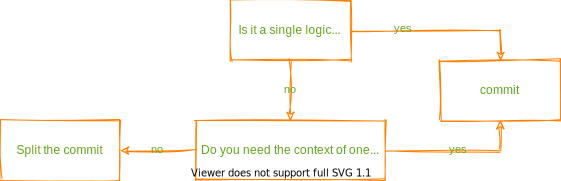
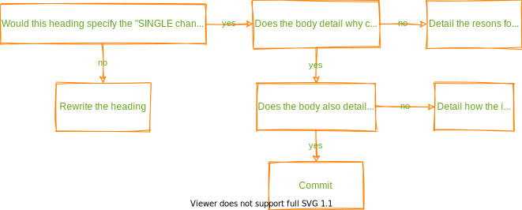
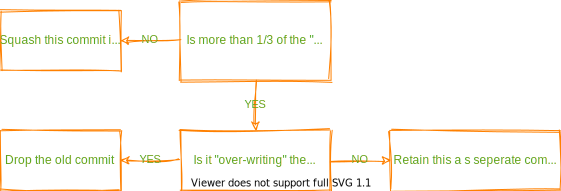
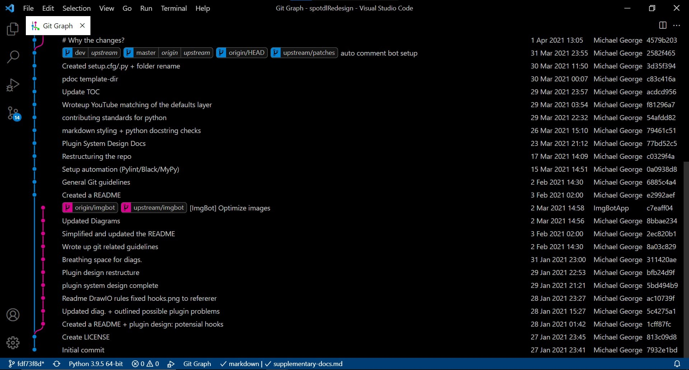
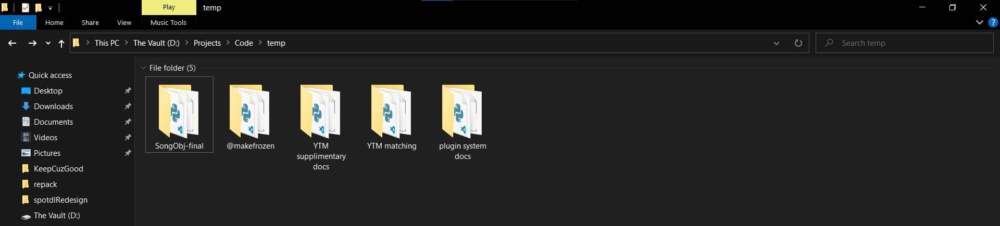
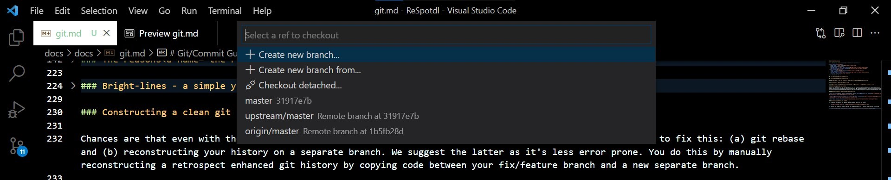
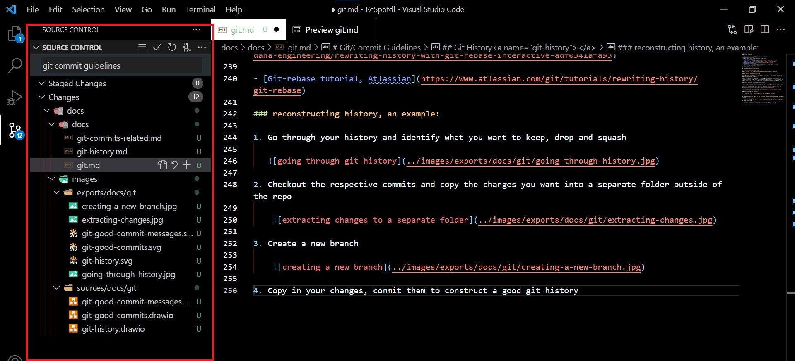

# Git/Commit Guidelines

<!-- mdformat-toc start --slug=github --maxlevel=6 --minlevel=2 -->

- [Git Commits](#git-commits)
  - [What makes a commit good?](#what-makes-a-commit-good)
  - [The reasons](#the-reasons)
  - [Bright-lines - a simple yes/no process](#bright-lines---a-simple-yesno-process)
  - [A generic-format for commit messages](#a-generic-format-for-commit-messages)
- [Git History](#git-history)
  - [How to create a good git history?](#how-to-create-a-good-git-history)
  - [The reasons](#the-reasons-1)
  - [Bright-lines - a simple yes/no process](#bright-lines---a-simple-yesno-process-1)
  - [Constructing a clean git history](#constructing-a-clean-git-history)
  - [External resources](#external-resources)
  - [reconstructing history, an example:](#reconstructing-history-an-example)

<!-- mdformat-toc end -->

## Git Commits<a name="git-commits"></a>

### What makes a commit good?<a name="what-makes-a-commit-good"></a>

1. __Granularity:__ Have each commit create a single "logical change". For example, if a
   commit (a) fixes a bug and (b) implements a feature request, it should be split.

2. __Cohesiveness:__ Keep "tightly coupled" logical changes together. A bug fix and its
   tests shouldn't be split.

3. __Good commit messages:__ A good commit message has 2 components (a) A descriptive
   Heading and (b) a body that expands on "why changes" and "how changes address the
   issue".

### The reasons<a name="the-reasons"></a>

1. __Small & cohesive commits:__

   - Small commits (consisting of a single logical change) are easier to review as the
     reviewer doesn't have to filter out the different "change-sets" in their minds,
     he/she can just plunge straight in and give straightforward, un-muddled feedback on
     your commit.

   - Sometimes changes require "context". For example, a bug fix and tests for the bug fix
     code. The tests would require the context of the bug fix code to be understood. In such a
     case, splitting commits requires reviewers to "keep in mind" the context of a
     different commit while reviewing the new one, it's much simpler to just package both
     the changes together so that the context is retained.

   - Yes, often times, a bug fix is iterated upon over the course of a PR, so you'd have
     the bug fix commit followed by a half dozen "improved bug fix" commits. In a way,
     "improving the bug fix code" is a single logical step in itself, so thats totally
     cool.

2. __Good commit messages:__

   - Lets say you track down the source of a bug to a conditional:
     `if req_data.strip() != '':` but your not sure why the conditional was introduced - it
     was introduced with a reason after all, so you search the file's git history till you
     locate this:

   ```diff
   - if req_data == ' ':
   + if req_data.strip() == '':
   ```

   and a commit message that reads: "modifies checks for data availability". Wow!
   Congratulations, you just discovered what you already know. You could comment out the
   reasons for change within your code, but that would lead to too much bloat - the git
   history of a file serves the purpose far better - provided it's combined with good clear
   commits and commit messages.

### Bright-lines - a simple yes/no process<a name="bright-lines---a-simple-yesno-process"></a>

1. __Small & cohesive commits:__

   

2. __Good commit messages:__

   

### A generic-format for commit messages<a name="a-generic-format-for-commit-messages"></a>

- Template:

  ```
  commit heading, a good one

  > Why Changes/Additions/Deletions?

  specify a folder, file or group of changes: why this set of changes was required
  ...

  > How does it help?

  specify a folder, file or group of changes from above> how this particular set solves
  the issue that necessitated its creation in the first place
  ...
  ```

- Example:

  ```
  Setup Github enforceable guidelines

  > Why Changes/Additions/Deletions?

  Workflows: Code standards that aren't enforced are absolutely useless.

  stale.yml: Helps with managing the repo, slightly lesser "human oversight"
  required

  PR/Issue templates: People sometimes make stupid/uninformative PRs/Issues.
  This is really annoying

  The rest: Supporting docs

  > How it helps?

  workflows: Github will clearly show if a commit matches all guidelines or not
  from here on out.

  stale.yml: Issues/PRs open for more than 30 days will be marked stale, 7 more
  days and they will be closed automatically

  PR/Issue templates: Gives people a lowdown of details to be submitted, lesser
  stupid annoying PRs/Issues

  the rest: needed to make sense of the templates
  ```

## Git History<a name="git-history"></a>

### How to create a good git history?<a name="how-to-create-a-good-git-history"></a>

1. __Merge relevant commits:__ When you have a series of commits that "tweaks" on a prior
   commit, merge them together so as to avoid unnecessary intermediate "out-of-context"
   changes. Do so only if the resultant commit constitutes a SINGLE logical change.

2. __Group related changes:__ When you have a series of related changes that qualify as
   different distinct changes, reorder your commits to create a clearer
   (retrospect-enhanced) git history.

### The reasons<a name="the-reasons-1"></a>

Development commits are usually of two types - ones with changes (bugfixes/new features)
and ones with tweaks. So lets say your tying to figure out why some change was made and
your git-log is your source of info (since commits would cause too much bloat) and this is
what you find:

- Commit A:
  ```diff
  + def print_output(obj):
  +     data = obj.data
  +     security_level = obj.level
  + 
  +     if security_level >= 10:
  +         print(data["key"]["RSA"]["ours"])
  +     elif security_level >= 5:
  +         print(data["key"]["RSA"]["theirs"])
  +     else:
  +         print(data["key"]["SILVERFISH"]["theirs"])
  ```
- Commit B:
  ```diff
  -     security_level = obj.level
  +     security_level = obj.__SecurityDataObj_level
  ```
- Commit C:
  ```diff
  -     elif security_level >= 5:
  -         print(data["key"]["RSA"]["theirs"])
  +     elif security_level >= 5.21:
  +         print(bix_hex_ascii(data["key"]["RSA"]["theirs"]))
  ```
- Commit D:
  ```diff
  +     elif security_level >= 5.21:
  -         print(bix_hex_ascii(data["key"]["RSA"]["theirs"]))
  +         required_data = data["key"]["RSA"]["theirs"]
  +
  +         if not required_data << 126 = 12:
  +             bin_hex_version = bix_hex_ascii(required_data)
  +         else:
  +             raise FactorizedPrimeException("Invalid key: is prime number encoded in hex")
  -     else:
  +
  +     else:
  +         print(data["key"]["SILVERFISH"]["theirs"])
  ```

Lets say that each commit message meticulously explains why the changes were made and how
they work - would it be easy to understand why `if not required_data << 126 = 12:` was
needed? Probably not. It's not hard because it wasn't explained, it's hard because it's
split up and the context that was available to the coder and reviewers when the code was
being written is not available to you. It's a mess. Something like the following squashed
commit would be a lot more easier to understand:

- Merged Commit:
  ```diff
  + def print_output(obj):
  +     data = obj.data
  +     security_level = obj.__SecurityDataObj_level
  + 
  +     if security_level >= 10:
  +         print(data["key"]["RSA"]["ours"])
  +     elif security_level >= 5.21:
  +         required_data = data["key"]["RSA"]["theirs"]
  +
  +         if not required_data << 126 = 12:
  +             bin_hex_version = bix_hex_ascii(required_data)
  +         else:
  +             raise FactorizedPrimeException("Invalid key: is prime number encoded in hex"
  +
  +     else:
  +         print(data["key"]["SILVERFISH"]["theirs"])
  ```

But this doesn't mean that we just squash all commit, we still want to retain "granularity
of change - if we indiscriminately squash everything, you'd end up with multiple "logical
changes" in a single commit which cannot be undone without loosing a lot of working
changes and neither does it provide a single clear message as to why a change was made -
you'd be writing partial documentation in commit messages (which we obviously don't want)
so, you re-order such "related but different" change commits together.

### Bright-lines - a simple yes/no process<a name="bright-lines---a-simple-yesno-process-1"></a>

1. __Grouping/Merging relevant changes:__

   

### Constructing a clean git history<a name="constructing-a-clean-git-history"></a>

Chances are that even with the best of efforts, your git history becomes a little messy.
There are two ways to fix this: (a) git rebase and (b) reconstructing your history on a
separate branch. We suggest the latter as it's less error prone. You do this by manually
reconstructing a retrospect enhanced git history by copying code between your fix/feature
branch and a new separate branch.

### External resources<a name="external-resources"></a>

- [Git Interactive Rebase, Squash, Amend and Other Ways of Rewriting History, Tute Costa](https://thoughtbot.com/blog/git-interactive-rebase-squash-amend-rewriting-history)

- [Rewriting History with Git Rebase Interactive, Anggrayudi Hardiannicko](https://medium.com/dana-engineering/rewriting-history-with-git-rebase-interactive-adf0341afa93)

- [Git-rebase tutorial, Atlassian](https://www.atlassian.com/git/tutorials/rewriting-history/git-rebase)

### reconstructing history, an example:<a name="reconstructing-history-an-example"></a>

1. Work on your PR as usual. Once complete, proceed to the following steps

2. Go through your history and identify what you want to keep, drop and squash

   

3. Checkout the respective commits and copy the changes you want into a separate folder
   outside of the repo

   

4. Create a new branch

   

5. Copy in your changes, commit them to construct a good git history

   

6. Switch out the original branch and the reconstructed branch in your PR
