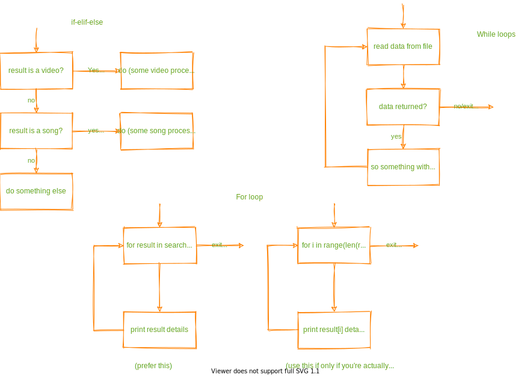

<!-- mdformat-toc start --slug=github --maxlevel=6 --minlevel=1 -->

- [Supplementary docs: what are they? why do we need them?](#supplementary-docs-what-are-they-why-do-we-need-them)
- [What do they contain?](#what-do-they-contain)
  - [Control flow documentation](#control-flow-documentation)
  - [System/Idea documentation](#systemidea-documentation)

<!-- mdformat-toc end -->

## Supplementary docs: what are they? why do we need them?<a name="supplementary-docs-what-are-they-why-do-we-need-them"></a>

This project's documentation can broadly be divided into 4 categories:

1. contributing guidelines (like this document)

2. Code API documentation (what you traditionally call "docs")

3. Control flow documentation (a super-helpful convenience)

4. System/Idea documentation (a necessity for development/maintenance)

The last two types of documentation is what we shall call "supplementary documentation".
Why do we need them? Because ***understanding good code is harder than writing good
code*** any day. Ever faced a situation where you're reading through a function for the
100th time but can't understand what the heck is happening? or you've somehow figured out
how each function works and what each class does but just can't seem to piece together how
everything fits together because things "just don't seem to make any sense" and your
wondering "how is this even related to that"? I've been there often & that's what
supplementary docs help out with - they outline a broad overview of how things work so you
have an idea of *whats supposed to be happening* making it a million times easier to
figure out *what is actually happening*.

## What do they contain?<a name="what-do-they-contain"></a>

### Control flow documentation<a name="control-flow-documentation"></a>

- A simple flowchart (without all the fancy shapes). An example - only the "yes", "no",
  "exit" text has to be carried into your diagrams:

  

- This isn't exactly a full-detail flowchart, just an overview, as long all if-else logic
  blocks and all loops are represented its enough.

- The diagrams for are to be grouped under the same location as the source file but under
  the `./docs/models/flow` folder. (eg. control flow diagrams for
  `./spotDL/defaults/search.py` will go under `.docs/models/flows/defaults/search.md`)

- Each control-flow file is to have 4 sections, unnecessary sections can be skipped:

  - __ToC (non-optional)__

  - __Classes__:

    - Contains public & private functions provided by the class

    - Section title:

      `## Classes`

    - Subsections for each class in the file:

      `### $class_name`

    - an unordered list of all (public & private) class functions:

      ```markdown
      #### $class_name.$function_name (type if any)
        
      ```

  - __Functions__:

    - Contains public & private functions provided at the module level

    - Section title:

      `## Functions`

    - an unordered list of all (public & private) class functions, specify generator if
      required:

      ```markdown
      ### $function_name [(generator)]
        
      ```

  - __Root Code__:

    - Contains all logic implemented at the file level, the code that gets run on import
      i.e all the stuff that is neither within a function or a class. There are no
      sub-sections:

      ```markdown
      ## Root Code
      
      ```

  - __Imaginary Example__:

    ```markdown
    # random.py control-flow's
    <!-- ./docs/flows/defaults/random.md (for random.py)-->
    <!--  Do note the .svg file source locations too -->

    ## Classes

    ### Song

    #### Song.from_dump (class method)
      

    #### Song.get_dump
      

    #### Song.file_system_safe_name (property)
      

    ## Functions

    ### find_on_spotify
      

    #### live_searcher (generator)
      

    ## Root Code
      
    ```

### System/Idea documentation<a name="systemidea-documentation"></a>

- Explains the basic ideas underlying implemented systems, the problems they solve, why
  the system is designed the way it is and how everything comes together into a functional
  whole.

- No particular format.

- Refer to the [plugin system docs](../models/.idea/plugin-system.md) for an example.
