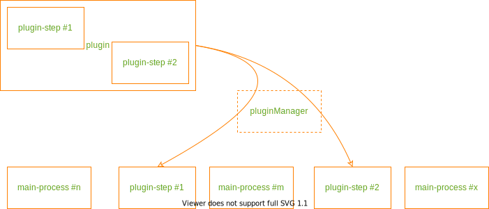
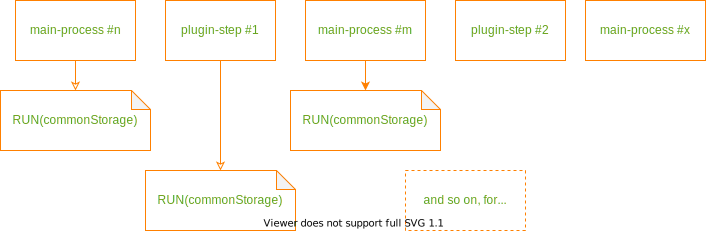

# The Plugin System Overview

<!-- mdformat-toc start --slug=github --maxlevel=6 --minlevel=2 -->

- [The Primary problems with plugin systems](#the-primary-problems-with-plugin-systems)
  - [1. Ease of plugin creation](#1-ease-of-plugin-creation)
  - [2. Plugin injection](#2-plugin-injection)
  - [3. Data Exchanges](#3-data-exchanges)
- [A brief discourse on "processes"](#a-brief-discourse-on-processes)
  - [Processes explained (by means of an analogy)](#processes-explained-by-means-of-an-analogy)
  - [The types of processes (by means of analogy, again)](#the-types-of-processes-by-means-of-analogy-again)
  - [So, what exactly is a plugin now?](#so-what-exactly-is-a-plugin-now)
- [This Plugin system - How it works](#this-plugin-system---how-it-works)
  - [The pluginManager](#the-pluginmanager)
  - [The commonStorage](#the-commonstorage)
- [How everything fits together](#how-everything-fits-together)
  - [Plugin-system functioning](#plugin-system-functioning)
  - [Additional notes](#additional-notes)

<!-- mdformat-toc end -->

## The Primary problems with plugin systems

### 1. Ease of plugin creation

Simply put, if you have to work your way through two dozen errors before you can nail down
your plugin, you're not very likely to put in all that much effort into writing plugins,
whereas if you get it correct after just half a dozen bug-fixes, you're more likely to
write up plugins. As far as I am concerned, a plugin system with very few plugins is
pretty useless.

There are primarily 2 factors that affect the ease of plugin creation a.k.a, contribute to
reduce the effort and errors you will probably need to fix:

1. The number of "points of control" - lets say you 2 apps that can access your phones
   flashlight and you have both open at the same time, you now have 2 "points of control"
   over your phones flashlight, if both apps "turn on" or "turn off" your flashlight at
   the same time all is well but, what if one wants to "turn on" the light while the other
   attempts to "turn off" the light? Chances are things won't work out. Having multiple
   overlapping "points of control" results in the same kind of problem requiring a
   plugin-author to start worrying about how things could possibly pan out and write
   exhaustive use-cases.

2. The extent of "structure imposed on the plugin-code" - the more you need to shoehorn
   code into some pre-determined structure, the more tedious the whole job becomes. It's
   that simple.

### 2. Plugin injection

A plugin is essentially foreign code run in between the main body of the process being
run. Sounds pretty straightforward but in the end a plugin is just code, and like any bit
of code there has to be a function call for something to run. How do you get to the
function call when you know next to nothing about the "foreign plugin-code" being run?
That is the crux of plugin injection.

### 3. Data Exchanges

Plugins being code, like any other piece of code does only one thing - process data in one
way or another. In other terms it needs inputs and gives you back outputs. So, just how do
you share data with plugin-code when you know next to nothing about it? This is the data
exchange problem.

## A brief discourse on "processes"

Now that you know the primary issues a plugin-system has to address, we need to talk about
process for a moment as the types of process that can be implemented with this plugin
system is very specific - **ONLY** linear processes.

### Processes explained (by means of an analogy)

Consider the steps to making a coffee:

1. You get a filter

2. You add coffee powder

3. You heat water

4. You add hot water to the filter, let it percolate through the coffee powder to obtain
   decoction

5. You get milk

6. You add decoction and sugar to the milk to get coffee

Note that each step is self contained, i.e. doesn't effect the other steps - weather I use
hot milk or cold milk, I'll still end up with coffee. Note also that the order is pretty
much fixed - even if I had the milk on hand before I made the decoction, it would be of no
use to me until after I've made the decoction. I could reorder steps a tiny-tiny bit but
there is no real reason to do so. For the purpose of this overview, something is only a
process if its steps are self-contained and have a specific pre-determined order.

### The types of processes (by means of analogy, again)

- **Branching processes**:

  Consider the purchase of a book from Amazon as the company would view it:

  1. Have a customer browse our catalog

  2. Have him/her/them choose a book

  3. Ask them what edition they would like - digital or hard-copy?

  4. If digital:

     1. Obtain a payment

     2. Transfer a copy of of the book to their kindle account

  5. If hard-copy:

     1. Notify the seller

     2. Have the book packed

     3. Have the packed book picked up and transported to the customer

     4. Have the book delivered

     5. Obtain a payment

  You see, the process splits into 2 different sets of (still) "self-contained" and
  "definitely-ordered" sequence of steps once the customer chooses weather he/she/they
  would like a digital or physical copy of the book. As the name indicates - "branching
  process".

- **Linear processes**:

  Things like making coffee constitute linear processes, there are no branchings like in
  the case of the Amazon book sale

- **Parallel processes**:

  Consider a code editor with plugin support, there are multiple things happening
  simultaneously:

  - The editor is "reading" your keystrokes and displaying text on screen

  - A plugin is highlighting the code based on what language your using

  - Another plugin is providing auto-complete suggestions as you type

  - Another plugin is checking your spellings in real time.

  All of this is happening at once, simultaneously, in parallel - a "parallel process".

- **Looping processes**:

  Consider writing a book:

  1. You write your first draft

  2. You pass it on to your editor/proof-reader for comments

  3. You write your next draft

  4. You pass it on to your editor/proof-reader for comments

  5. You write your third draft

  6. Repeat

  It's a back-and-forth loop between you and your editor/proof-reader - a "looping
  process".

### So, what exactly is a plugin now?

From here on out, a plugin will refer to a single step or a group of steps "inserted" into
the main process at hand.

For example, adding a "heat the milk" step (it's a self-contained step) before you mix in
the decoction to make coffee (and has a defined-position) so as to make "hot coffee" would
constitute a single step plugin. Alternatively, adding a "cool the milk" step before you
mix in the decoction and a "add froth" step after you mix in the decoction to make coffee
to make "cold, frothy coffee" would constitute a multi-step plugin.

Another point of note is that the position of where a plugin-step is to be inserted can be
defined in terms of the steps of the main-process. From our "hot coffee" plugin example,
the additional step of "heating milk" was inserted "before" mixing in decoction. Since
each step is self-contained, the order in which plugin-steps are inserted in between
main-process steps should not matter and hence, the position of any plugin-step can be
defined as "before" or "after" some main-process step.

## This Plugin system - How it works

This plugin-system is mainly composed of 2 major components - the "pluginManager" and the
"commonStorage".

### The pluginManager

THe job of the pluginManager is to "load" the plugins.

Each main-process step is given a unique "stepCode" which is just an alpha numeric
identifier with no spaces. The position of each plugin is defined with in relation to
these main-process steps as either "stepCode-" for before said step or "stepCode+" for
after said step. If there are multiple plugin-steps to be inserted before some
main-process step, the order in which they are inserted/run shouldn't matter as each step
is supposed to be "self-contained".

The actual step insertion (plugin injection) is done by searching for a function named
`RUN` that takes a single arg - the commonStorage as its input and running it when
required. In other terms, each plugin has to define a function `def RUN(commonStorage):`
to be able to integrate into this plugin-system. THe `RUN` function acts as the entry
point, the function that gets the ball rolling so to speak.

This helps with ease of plugin creation as the pluginManager is the sole "point of
control", every detail of how the plugin is handled by the plugin-system is in the hands
of the pluginManager, period.

### The commonStorage

The commonStorage stores data "across steps". It has a "compartment" for each plugin and
one for the main-process. Any plugin and/or main-process step can read data from any
compartment but can only modify data from its own compartment. This ensure that a
multi-step plugin can exchange data across its different steps, the format of data storage
is not an issue as the plugin-author cooks the format up and hence already know the format
in which the data is stored.

The format of data storage of the main-process is clearly defined and supplied to
plugin-developer so they can access main-process data now that they know the data storage
format. This helps make plugin development easier as there is minimal structure imposed
onto the plugin-code being written.

## How everything fits together

### Plugin-system functioning

1. The pluginManager "loads" all the plugins and inserts/injects plugin-steps into the
   main-process as required

   

2. The pluginManager serially executes the `RUN(commonStorage)` entry-point for each step
   of the final process (i.e. main+plugin steps)

   

### Additional notes

Since the main-process steps aren't much different from the plugin-steps in the fact that
they're self-contained, you could actually consider the main-process a special type of
plugin where you supply individual steps instead of a collection of minor, in-between
steps.

You might want to create a "defaults layer" that consists of functionality often called
upon by plugins. This would greatly help in reducing the tedium of writing new plugins.
