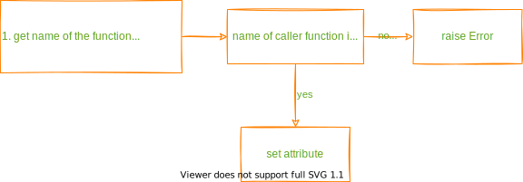

<!-- mdformat-toc start --slug=github --maxlevel=6 --minlevel=2 -->

- [Functions](#functions)
  - [conditional_setter](#conditional_setter)
  - [make_frozen](#make_frozen)

<!-- mdformat-toc end -->

## Functions

### conditional_setter

### make_frozen

