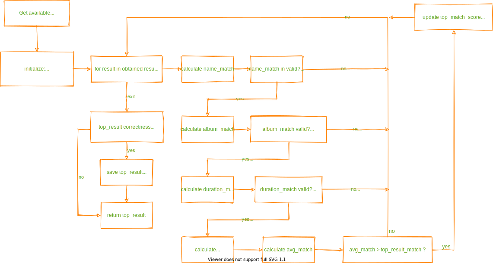
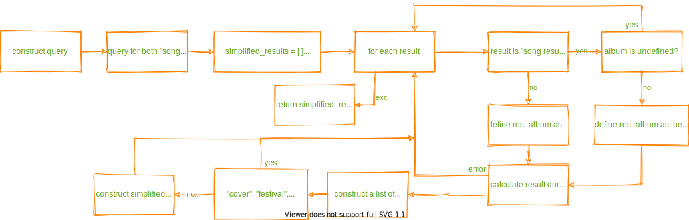
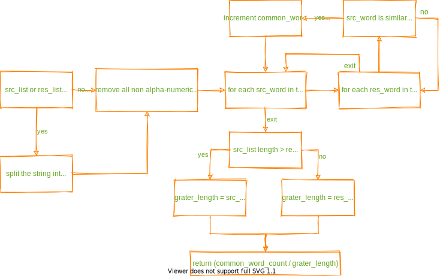
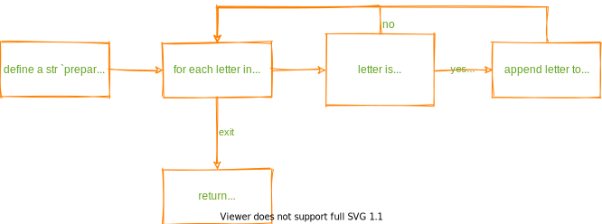
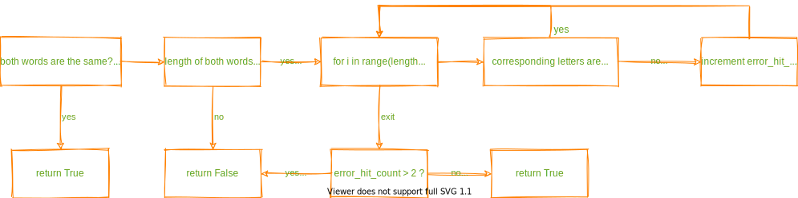

<!-- mdformat-toc start --slug=github --maxlevel=6 --minlevel=2 -->

- [Functions](#functions)
  - [get_youtube_link](#get_youtube_link)
  - [\_\_query_ytmusic](#__query_ytmusic)
  - [\_\_common_elm_fraction](#__common_elm_fraction)
  - [\_\_prepare_word](#__prepare_word)
  - [\_\_is_similar](#__is_similar)

<!-- mdformat-toc end -->

## Functions

### get_youtube_link

### \_\_query_ytmusic

### \_\_common_elm_fraction

### \_\_prepare_word

### \_\_is_similar

